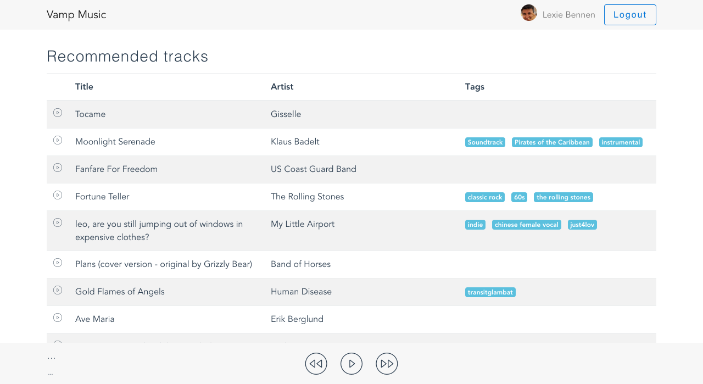

# Vamp Music



Vamp Music is a set of demo services with a front end and api gateway.
It uses [Lerna](https://lernajs.io/) to manage all the packages in the repo and
docker-compose to spin up a local dev environment, similar to an eventual Vamp environment.

Requirements:
-   Node.js
-   Docker and Docker-Compose
-   Lerna

## Install

```bash
npm install --global lerna
lerna bootstrap
lerna run docker:build
docker-compose up
```

Now hit `localhost:80`

## Architecture

Vamp Music is a simplified but representative example of a service based architecture.
1. Clients connect to an API gateway that authenticates and aggregates and proxies services.
2. Each service owns their datasource(s) and exposes REST and/or RPC type calls.


```
                         ----------> Auth
                         |
Web-client (SPA) --> API Gateway --> Profile
                                 --> Recommended --> Songs*
                                 --> Charts
                                 --> Songs*                                                             
```
